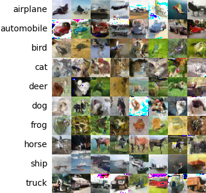
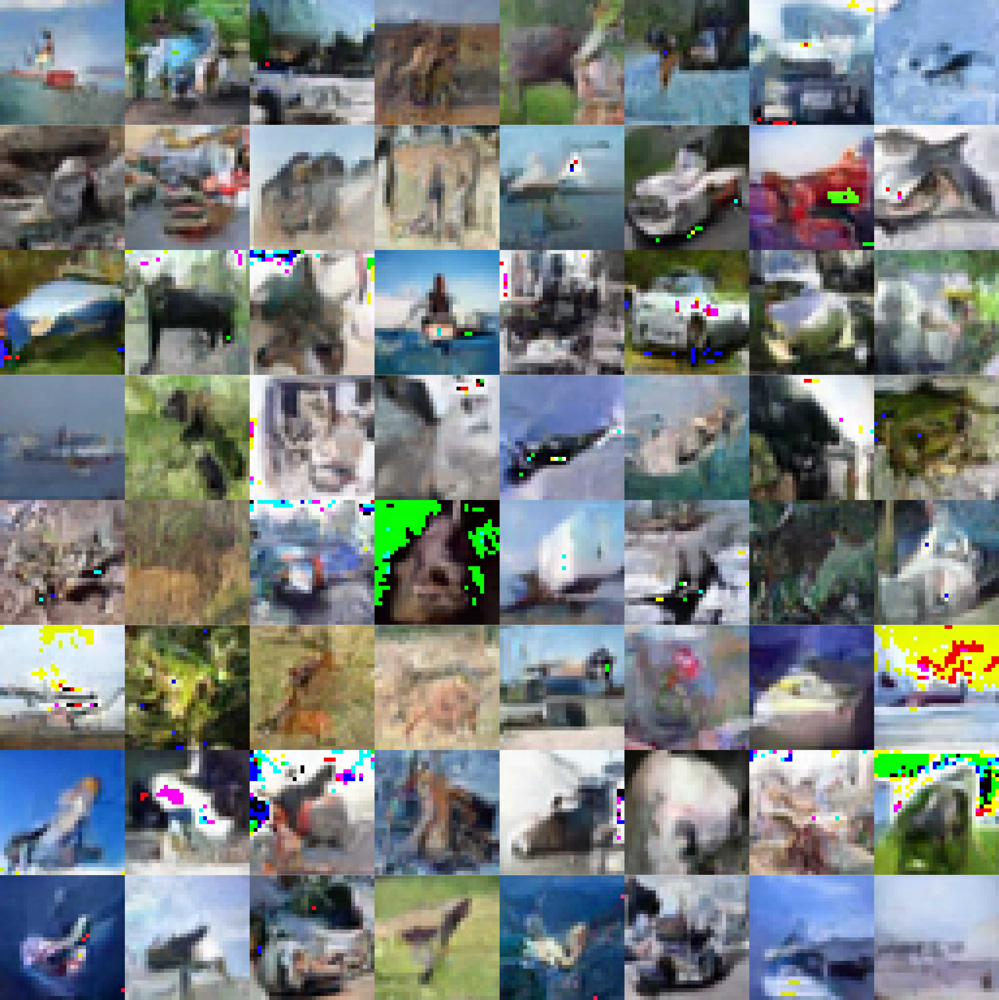

# Denoising Diffusion Pytorch
Implementation of DDPM in Pytorch. https://arxiv.org/abs/2006.11239.



## Training
```
accelerate launch train.py
```

## Sample Image Grid
Generate samples and render a grid of images into one image.

### No Labels
```
python sample_grid.py --checkpoint_path=<path> --rows=8 --cols=8
```


### Labels
```
python sample_grid.py --checkpoint_path=<path> --cols=8 --num_classes=10 --labels_list="airplane,automobile,bird,cat,deer,dog,frog,horse,ship,truck"
```


## Save Images to Folder
Save a large number of images to a destination folder for running eval metrics.
```
python sample_images.py --checkpoint_path=<path> --output_dir=<dir> --num_images=50000 --batch_size=2500
```
